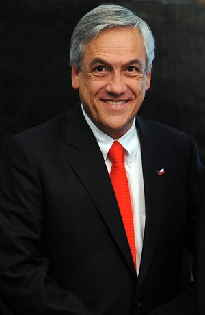
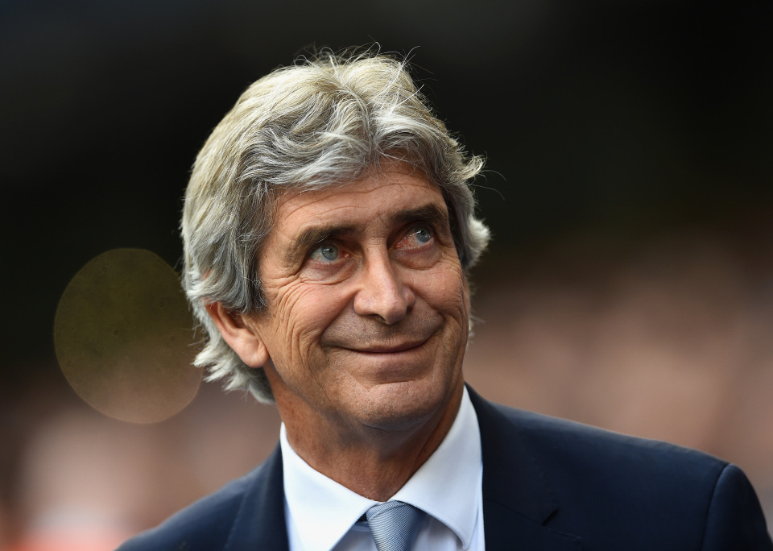

Famous People
=============

Sebastian Pinera
----------------
Sebastian is the current President of Chile. He has
been serving since 2018, and has served a previous
term from 2010 to 2014.
Prior to presidency, he served as senator for East
Santiago, foundedgi of many socioeconomic foundations,
and is a well-known economist and businessman.

*Sebastian Pinera* [#SP1]_

Alexis Sanchez
--------------
Alexis Sanchez is a professional soccer player who
has played for teams in Chile, Spain, Italy, and
England. He currently plays for Inter Milan, on loan
from Manchester United. He is the all-time leading
goal scorer for the Chilean National Soccer Team and
also has the most appearances for them.

*Alexis Sanchez* [#AS2]_

Manuel Pellegrini
-----------------
Manuel is a former soccer player, but found more
success as a manager later in his career. He
currently manages West Ham United in England, but
has managed other teams in England, Spain, and
South America. His greatest achievement thus far
has been winning the Premier League title with
Manchester City.

*Manuel Pellegrini* [#MP3]_

.. rubric:: Footnotes

.. [#SP1] "`Sebastian Pinera <https://zenit.org/articles/chile-holy-father-receives-president-sebastian-pinera-echenique/>`_". Zenit. (2018-10-13) Retrieved 2019-12-03.
.. [#AS2] "`Alexis Sanchez <https://www.independent.co.uk/sport/football/premier-league/arsenal-news-alexis-sanchez-chile-vs-uruguay-arsene-wenger-injury-a7420386.html>`_". The Independent. (2016-11-16) Retrieved 2019-11-30.
.. [#MP3] "`Manuel Pellegrini <https://talksport.com/football/576466/manuel-pellegrini-most-expensive-signings-fee-sebastien-haller-cristiano-ronaldo-eliaquim-mangala/>`_". Talksport. (2019-07-23) Retrieved 2019-11-30.
