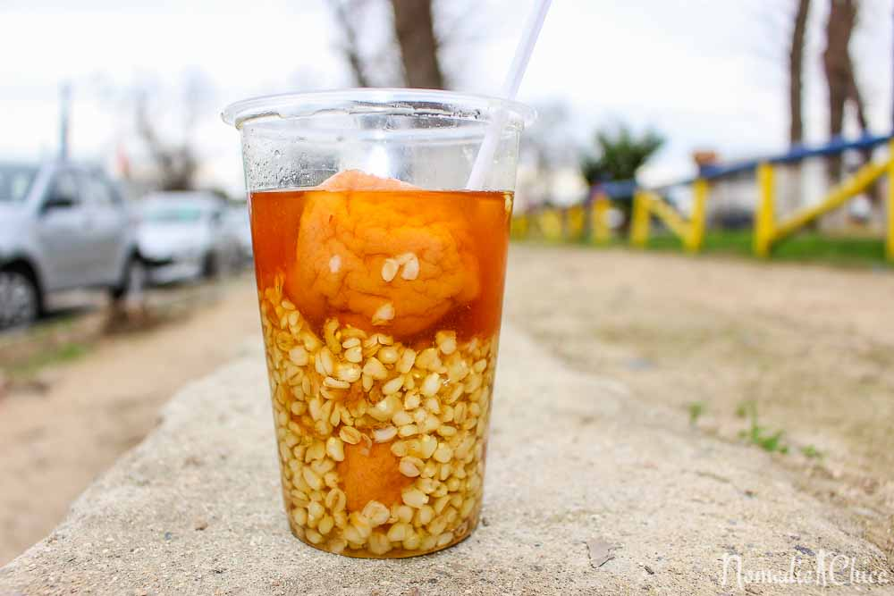

Chilean Food
============

Due to it's mixed heritage of indigenous customs and Spanish additions, the cuisine of Chile is
very interesting to most visitors. Furthermore the separation of many parts of the country from
other South American countries differentiates its cuisine. Below are some of the many tasty treats
you can try in **Chile**!

Empanadas
---------

Empanadas are a bread pastry filled with cheese, meat, and some vegetables. The meat within the
empanadas depends on geographical location, high in the Andes ground beef with traditionally be
used but on the shores seafood is more common.

Ceviches
--------

Ceviches are popular all over South America, however Chileans make their's with marinated fish,
onions, red peppers, and many spices.

Cazuela
-------

Cazuela is the most popular soup in **Chile**. It consists of hot broth with large meat chunks,
potatoes, pumpkin, and corn noodles.

Humitas
-------

From pre-hispanic Andean cultures, a humita are similar to a Mexican tamale, but are very sweet.

Mote con Huesillos
------------------

Drink made of husked wheat (mote) and dried peaches (huesillos) in sugary water.

*Mote con Huesillos* [#F1]_

Vino Rojo (Red Wine)
--------------------

**Chile**'s red wine is world-renowned. The central part of **Chile** is well-suited for grape growing.
Some of the better known red wines from **Chile** are Chardonnay, Pinot Noir, and Cabernet Sauvignon.

.. rubric:: Footnotes

.. [#F1] "`Mote con Huesillos <https://www.nomadicchica.com/tasty-world-mote-con-huesillos-chile/>`_". Nomadic Chica. (2015-09-08) Retrieved 2019-12-04.
