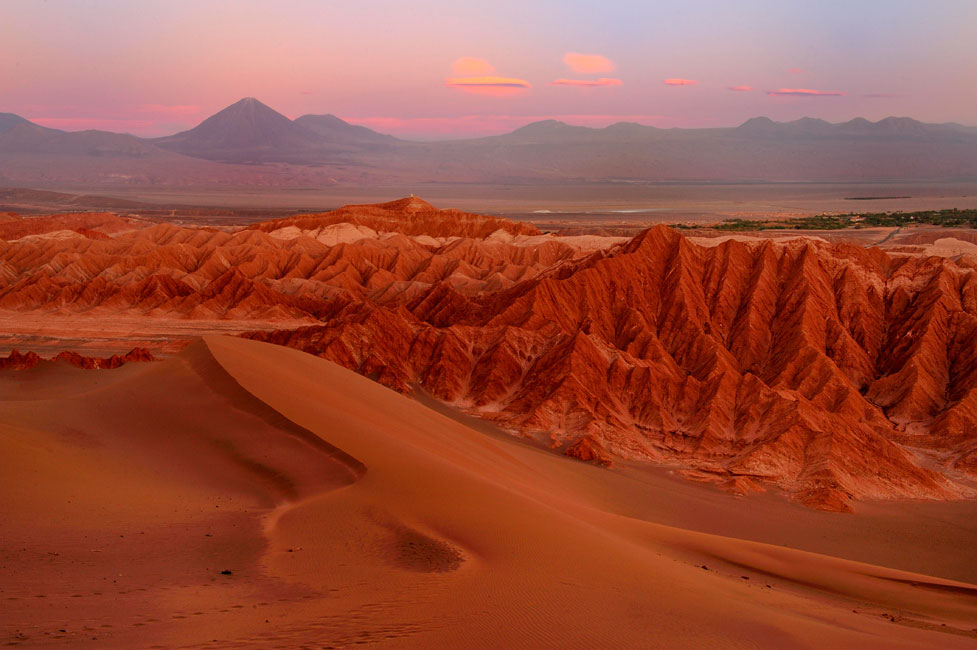
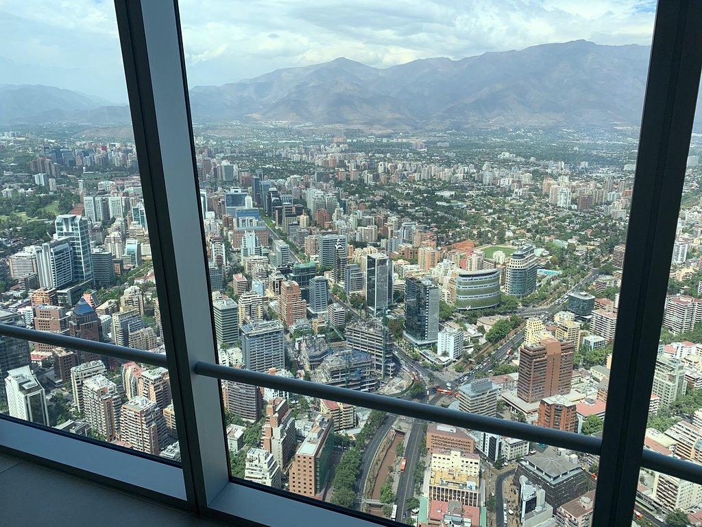

Chilean Travel Destinations
===========================

There are ma

Atacama Desert
--------------

The Atacama Desert

*Atacama* [#T1]_

Santiago
--------

Santiago is the capital city of Chile and is a great place to learn more about the culture of Chile.
The city is always bustling and there are activities and attractions for all kinds of people!

**Activities**

*Sky Costanera* [#T2]_

Torres del Paine
----------------
Places to visit in Torres del Paine National Park

* Southern Ice Fields
    * The Southern Ice Fields is the 3rd largest water reserve in the world.
      It can be viewed two ways, either by boat that can take you up close to
      the giant or view it from afar on land.
* Grey Glacier
* Amarga Lagoon

    * The Amarga Lagoon is an impressive site.

    .. image:: C_Lagoon.jpg

    *Amarga Lagoon* [#T3]_

* Salto Grande
    * Large waterfall

.. rubric:: Footnotes

.. [#T1] "`Atacama <https://www.nikonusa.com/en/learn-and-explore/nikon-school/workshop/htqz9jbg/a-photographic-expedition-in-patagonia-and-atacama-chile.html#!/media:image:Katsu-Tanaka-2014_patagonia_mountains-030.jpg>`_". Nikon USA. (2015) Retrieved 2019-12-04.
.. [#T2] "`Sky Costanera <https://www.tripadvisor.com/Attraction_Review-g294305-d8594663-Reviews-Sky_Costanera-Santiago_Santiago_Metropolitan_Region.html#photos;aggregationId=101&albumid=101&filter=7&ff=435174897/>`_". Trip Advisor. (2019-09) Retrieved 2019-12-04.
.. [#T3] "`Amarga Lagoon <https://torresdelpaine.com/en/atraccion/amarga-lagoon/>`_". Torres Del Paine. (2013) Retrieved 2019-12-03.
