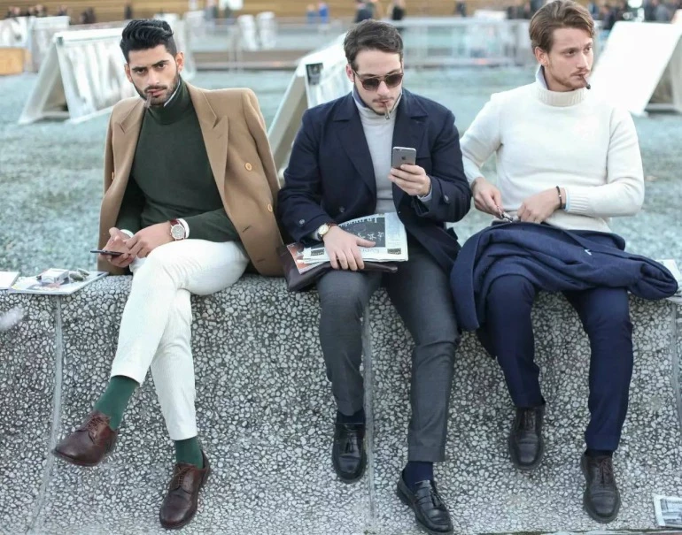

Italian Culture
===============

Language
--------

The official language of Italy is officially Italian.
However, there is a larger percentage of the Italian
population that is able to communicate in english to
be able to talk to tourists and other travelers.

Traditional Clothing
--------------------

Italian's take their fashion very seriously. Typical
clothes with clean lines that fit you well are
standard, like button down shirts for men and capri
pants for women. Additionally, choose classy shoes
such as boots or ballet flats, since Italians
generally frown on wearing things like flip flops in
public.

*Typical Men's Fashion* [#MF1]_

Italian Holidays
----------------

.. list-table:: Holidays
    :widths: 20 10 50 50
    :header-rows: 1

    * - Name
      - Date
      - Reason
      - How it's Celebrated
    * - Liberation Day (Festa della Liberazione)
      - April 25th
      - Italy's Liberation Day, also known as the
        Anniversary of the Liberation, Anniversary of
        the Resistance, or simply 25 April is a
        national Italian holiday commemorating the
        end of Nazi occupation of the Country during
        World War II and the victory of the Resistance.
      - Celebrated by ceremonies, historic
        re-enactments, and celebrations commemorating
        the end of World War II in Italy. Many towns
        hold fairs, concerts, food festivals, or
        special events.
    * - Winter in Italy with Venice Carnival
      - January 6th
      - Marks the end of Italy's Christmas season and
        the day when children get presents from
        la Befana.
      - In Vatican City, a procession of hundreds of
        people in medieval costumes walk to the
        Vatican, carrying symbolic gifts for the Pope
        who says a morning mass in Saint Peter's
        Basilica to commemorate the visit of the Wise
        Men bearing gifts for Jesus. Read more about
        nativity processions and pageants as well as
        festivals for la Befana in Epiphany and la
        Befana.

.. rubric:: Footnotes

.. [#MF1] "`Men's Fashion <https://theidleman.com/blogs/news/what-to-wear-in-italy>`_". TheIdleMan. (2018-11-13) Retrieved 2019-12-04.