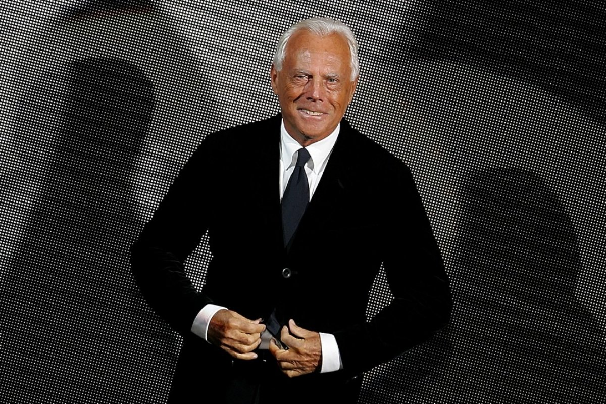
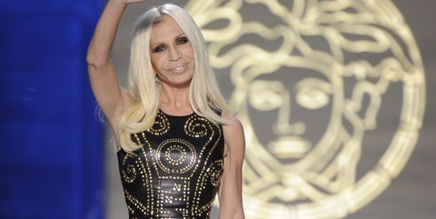

Famous Italians
===============

Giorgio Armani
--------------

Girogio Armani was born on July 11th, 1934. He was an
Italian fashion designer.He is known today for his
clean, tailored lines. He is credited with pioneering
red-carpet fashion. Armani created his company in
1975, Armani, and by 2001 was acclaimed as the most
succesful designer in all of Italy. As of the year
109, Armani's net worth is a very impressive 10.8
billion USD.

*Giorgio Armani* [#GA1]_

Donatella Versace
-----------------

Designer Donatella Versace is one of the best known
names in fashion today. She is the younger sister of
the late designer Gianni Versace. Donatella attended
a university in Florence for a time, but she
eventually reunited with Gianni to support her
brothers clothing business. She has taken over the
"Versace" brand and has a net worth of $800 million
USD.

*Donatella Versace* [#DV2]_

Leonardo da Vinci
-----------------

Leonardo da Vinci (1452-1519) was born in Anchiano,
Tuscany (now Italy), close to the town of Vinci that
provided the surname we associate with him today. In
his own time he was known just as Leonardo or as “Il
Florentine,” since he lived near Florence—and was
famed as an artist, inventor and thinker. He created
famous works such as the Mona Lisa, The Last Supper,
and Mary Magdalene.

.. image:: I_Vinci.jpg

*Leonardo da Vinci* [#LV3]_

.. rubric:: Footnotes

.. [#GA1] "`Giorgio Armani <https://www.scmp.com/magazines/style/fashion-beauty/article/2111774/giorgio-armani-says-successor-need-not-be-italian>`_". Luxury. (2017-09-19) Retrieved 2019-12-04.
.. [#DV2] "`Donatella Versace <https://www.harpersbazaar.com/culture/film-tv/g15052708/donatella-versace-facts-american-crime-story/>`_". Harpers Bazaar. (2019-01-16) Retrieved 2019-12-04.
.. [#LV3] "`Leonardo da Vinci <https://www.biography.com/artist/leonardo-da-vinci>`_". Biography. (2019-08-21) Retrieved 2019-12-04