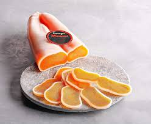
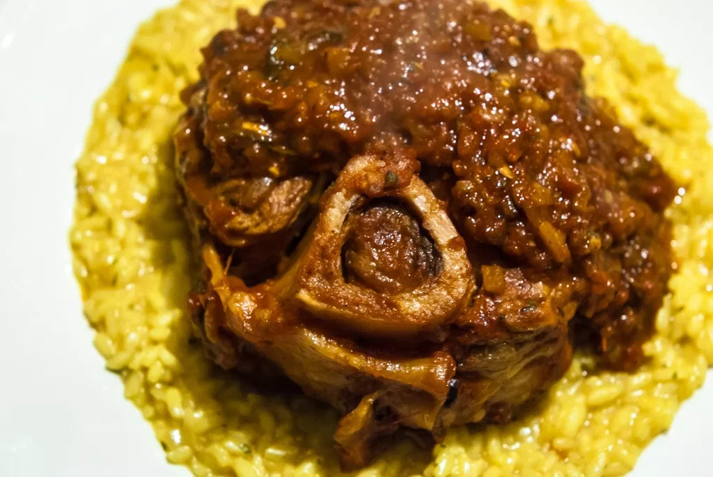

Italy Food
==========

Traditional Food
----------------

Pizza
~~~~~

Though a slab of flat bread served with oil and
spices was around long before Italy, there's
perhaps no dish that is as common or as
representative of the country as pizza. Easy,
cheap, and filling, pizza has long been a common
snack or meal. When the Italian Queen Margherita came
through the bustling city of Naples on a tour of
her kingdom in 1889 she asked to try this dish.
A local entrepreneur served her the now legendary
combination of tomato sauce, mozzarella, and
basil, creating (or more likely, branding) the
Margherita pizza.

Bottarga
~~~~~~~~

Another way to describe bottarga is "Sicilian
Caviar". In August and September southern
Italians take the roe from grey mullets, salt it
, press it, and then leave it to air dry for six
months. The result is a solid hunk of eggs the
color of amber and blood oranges that, when
sliced and eaten or grated over pasta, blossoms
into a gloriously savory, smoky, and briny
bouquet. Though essentially a poor man's answer
to preserving seafood in the days before
refrigeration, it is now considered one of the
most sought after and luxurious foodstuffs in
Italy.

*Sliced Bottarga* [#SI1]_

Ossobuco
~~~~~~~~
The world-famous ossobuco is a
bone-in veal shank, cooked low and slow until
meltingly tender in a broth of meat stock, white
wine, and veggies. Traditionally, it's
accompanied by a gremolata (lemon zest, garlic,
and parsley) but that's optional. Despite
the popularity of ossobuco (which literally
means 'hollow bone'), it's not always common to
see it on restaurant menus because it needs
about three hours of cooking time.

*Cooked Ossobuco* [#CO2]_

.. rubric:: Footnotes
.. [#SI1] "`Bottarga <https://www.amazon.com/Bottarga-Gold-Mullet-Handmade-Kosher/dp/B00IZICOT4>`_". Amazon. (2018-09-18) Date Retrieved 2019-12-12
.. [#CO2] "`Ossobuco <https://www.walksofitaly.com/blog/all-around-italy/the-16-most-iconic-foods-to-eat-in-italy>`_". Walks. (2017-07-04) Date Retrieved 2019-12-12