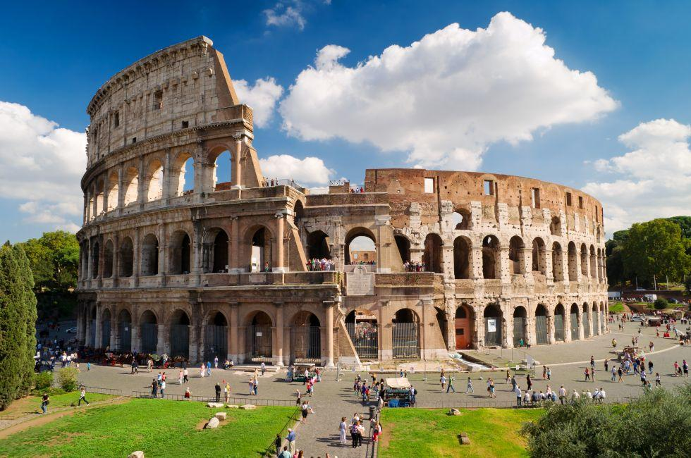

Italy Travel Destinations
=========================

Rome
----

Rome houses Vatican City, the world's smallest nation
and the political and religious center of the Roman
Catholic Church. Millions of people flock Rome every
year with the primary purpose of visiting this site,
which is believed to be situated on Apostle Peter's
burial place.

*Rome Colloseum* [#RC1]_

Florence
--------

Florence has a very rich history. It is home to the
historic Uffuzi Gallery which houses some of Italy's
most exquisite artwork. Florence is also home to some
of the most unique architecture in the world. Along
with that, Florence is very well known for its
extravagant food and wine.

*Florence* [#FI2]_

Venice
------

Venice is known throughout the world as the "Floating
City" due to the fact that water levels are rising and
surrounding the city providing a unique style to the
city. This also helps with another tourist attraction,
Gondola rides. It is a unique style of boat that is used
for tours and other various occasions.

.. image:: I_Venice.jpg

*Venice Gondola* [#VG3]_

.. rubric:: Footnotes

.. [#RC1] "`Roman Colloseum <https://www.fodors.com/world/europe/italy/rome>`_". Fodor's Travel. (2019-09-19) Retrieved 2019-12-12
.. [#FI2] "`Forence <https://www.departures.com/travel/florence-italy-travel-guide>`_". Departures. (2019-04-14) Retrieved 2019-12-12
.. [#VG3] "`Venice Gondola <https://expertvagabond.com/venice-italy-things-to-do/>`_". Expert Vagabond. (2019-11-02) Retrieved 2019-12-12