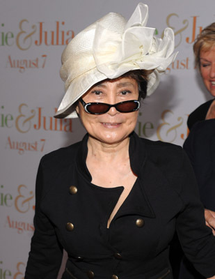
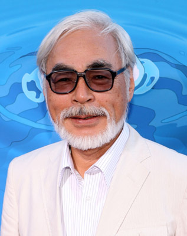
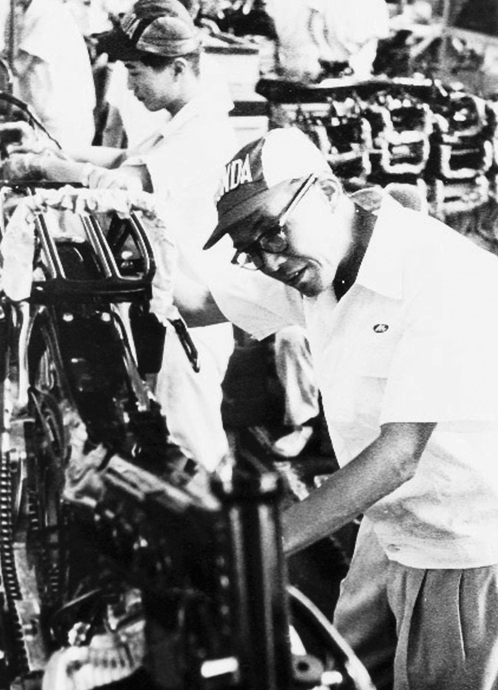

Famous Japanese People
==============================

Yoko Ono:
~~~~~~~~~~~~~~~~

    Yoko Ono [#f1]_

Yoko Ono is a famous activist, musician, and artist. She was born in Japan in 1933 coming from family with royal heritage. She started her activism early with defiant acts such as visiting her friends in the boys school. She moved to the United States and attended college for music in New York. In New York she was part of many musical and artistic pieces. She was married three times, most famously to John Lennon, and has two children. [#f2]_

Hayao Miyazaki:
~~~~~~~~~~~~~~~~~~~~~~~

    Hayao Miyazaki [#f3]_

Hayao Miyazaki is a famous animation director, animation artist, story teller, and manga artist. He was born in Tokyo in 1941. He started his career in animation with the Toei Douga studio and proceeded to create animations for several companies. He founded his own animation company with friend and fellow artist Isao Takahata. His animation company is Studio Ghibli which has received world-wide attention and has partnered with Disney to bring his stories to other areas of the world. [#f4]_

Honda Soichiro:
~~~~~~~~~~~~~~~~

    Honda Soichiro [#f5]_

Honda Soichiro was a famous industrialist and engineer. He was born in the Shizuoka prefecture in 1906. He started his work at 15 as a mechanic and went on to create his own repair shop and to make and drive race cars. His company made engines for the Japanese army during WWII. He later founded the Honda Motor Company and the Honda Technical Research Institute. He remained as president of Honda Motor Company until 1973 and oversaw the growth of the company from only selling motorcycles in Japan to becoming a major motor company around the world. He is responsible for over 100 patents. [#f6]_

.. rubric:: Footnotes

.. [#f1] "`Yoko Ono Picture <https://www.imdb.com/name/nm0648780/mediaviewer/rm1893959936/>`_". IMDb. 2019. Retrieved 2019-12-10.
.. [#f2] "`Yoko Ono Biography <https://www.imdb.com/name/nm0648780/bio?ref_=nm_ov_bio_sm/>`_". IMDb. 2019. Retrieved 2019-12-10.
.. [#f3] "`Hayao Miyazaki Picture <https://www.imdb.com/name/nm0594503/mediaviewer/rm1558808832/>`_". IMDb. 2019. Retrieved 2019-12-10.
.. [#f4] "`Hayao Miyazaki Biography <https://www.imdb.com/name/nm0594503/bio?ref_=nm_ov_bio_sm/>`_". IMDb. 2019. Retrieved 2019-12-10.
.. [#f5] "`Honda Soichiro Picture <https://www.britannica.com/biography/Honda-Soichiro#/media/1/270752/97364/>`_". Britannica. 2019. Retrieved 2019-12-10.
.. [#f6] "`Honda Soichiro Biography <https://www.britannica.com/biography/Honda-Soichiro/>`_". Britannica. 2019. Retrieved 2019-12-10.