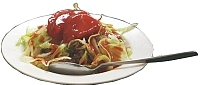

Japanese Food
===================

Japan is home to a wide variety of delectable dishes. The most popular Japanese food being sushi. Overall, Japan incorporates a lot of seafood into their diets. Japan is also fond of noodles, most notably ramen, soba, and udon. Japan also incorporates rice inmost if not every meal. [#f1]_

.. figure:: j_sushi.jpg

    Sushi [#f2]_

Every prefecture has special dishes that they are known for nation-wide. For example, Okinawa prefecture is known for taco rice, which consists of American-style taco fillings on rice instead of a tortilla, and for their special alcohols. [#f3]_

    Taco Rice [#f4]_

For more information on Japanese cuisine watch the Begin Japanology Food `playlist`_ on YouTube.

.. _playlist: https://www.youtube.com/watch?v=_DSzKh67kS8&list=PLfCk374GUQIj1YZjwFZqIPBAeRkTsA7ya

**Make some yourself**

Recipe: Sushi Roll [#f5]_

**Allergen Notice:** *Please note that this recipe contains fish, particularly imitation crab meat. Please substitute for another meat if you are allergic or make a veggie roll instead.*

* Ingredients:
    * 2/3 cup uncooked short grain white rice
    * 3 tablespoons rice vinegar
    * 3 tablespoons white sugar
    * 1 1/2 teaspoons salt
    * 4 sheets nori seaweed sheets
    * 1/2 cucumber, peeled, cut into small strips
    * 2 tablespoons pickled ginger
    * 1 avacado
    * 1/2 pound flaked imitation crab meat
* Instructions:
    * In a medium saucepan, bring 1 1/3 cups water to a boil. Add rice, and stir. Reduce heat, cover, and simmer for 20 minutes. In a small bowl, mix the rice vinegar, sugar ,and salt. Blend the mixture into the rice.
    * Preheat oven to 300 degrees F (150 degrees C). On a medium baking sheet, heat nori in the preheated oven 1 to 2 minutes, until warm.
    * Center one sheet nori on a bamboo sushi mat. Wet your hands. Using your hands, spread a thin layer of rice on the sheet of nori, and press into a thin layer. Arrange 1/4 of the cucumber, ginger, avocado, and imitation crabmeat in a line down the center of the rice. Lift the end of the mat, and gently roll it over the ingredients, pressing gently. Roll it forward to make a complete roll. Repeat with remaining ingredients.
    * Cut each roll into 4 to 6 slices using a wet, sharp knife.

*Tip: use a clean dish towel in place of the bamboo sushi mat.*

.. rubric:: Footnotes

.. [#f1] "`Basic Food <https://www.japan-zone.com/culture/food.shtml/>`_". Japan Zone. 2019. Retrieved 2019-12-10.
.. [#f2] "`Sushi Picture <https://livejapan.com/en/article-a0000370//>`_". Live Japan. 2018. Retrieved 2019-12-05.
.. [#f3] "`Okinawa Food <https://www.japan-guide.com/e/e7128.html/>`_". Japan-Guide. 2019. Retrieved 2019-12-10.
.. [#f4] "`Taco Rice Picture <https://www.japan-guide.com/e/e7128.html/>`_". Japan-Guide. 2019. Retrieved 2019-12-10.
.. [#f5] "`Sushi Roll Recipe<https://www.allrecipes.com/recipe/24228/sushi-roll//>`_". 1ORANGE1. allrecipes.com. 2019. Retrieved 2019-12-05.