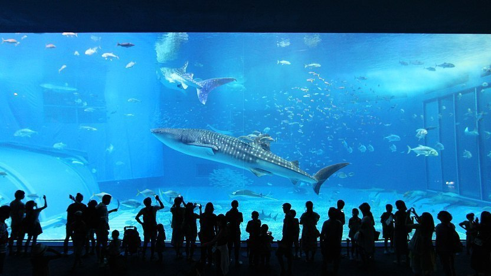

Top Travel Destinations in Japan
========================================

*Mt. Fuji*

Mount Fuji is one of Japans most well know natural features. Depicted in paintings, pictures, movies, and more, this glorious mountain is a highlight of any Japanese nature trip. Mount Fuji can both be appreciated from afar in a hot spring or by climbing up it’s side! Guided climbs of this famous mountain are available throughout the day. [#f1]_

    Mt. Fuji [#f2]_

*Okinawa Churaumi Aquarium*

While in Japan be sure to hope to the Okinawa islands and visit the famous Churaumi Aquarium.  One of the best aquariums in the world, Churaumi is part of an expo park that is big enough to hold whale sharks. With observable feeding times, a deep sea experience room, dolphin shows, guided tours and over 740 species, this aquarium is must for all ages. [#f3]_

    Churaumi Aquarium [#f4]_

*Tokyo*

Tokyo is the most famous city in Japan. The bustling city is home to people from all over the world and is a business and cultural boom that you won’t want to miss. Tokyo is known for its technology, style and innovation while upholding the beauty of traditional Japanese culture. [#f5]_

.. figure:: j_tokyo.jpg

    Tokyo [#f6]_

*Maruoka Castle Cherry Blossom Festival*

The Maruoka Castle has the oldest wooden keep in Japan. The castle is home to Kasumigajo park that was established in commemoration of the castle’s 400th anniversary. The castle is home to a cherry blossom festival thanks to it’s nearly 400 cherry trees. Between April1st and 20th the castle holds the festival where visitors are welcome during the day and also at night when the castle and cherry tree path are illuminated. [#f7]_

    Marouka Castle with cherry blossoms [#f8]_

.. rubric:: Footnotes

.. [#f1] "`Mt. Fuji <https://www.japan.travel/en/fuji-guide//>`_". Japan National Tourism Organization. 2019. Retrieved 2019-12-10.
.. [#f2] "`Mt. Fuji Picture <https://english.kyodonews.net/news/2019/05/308ed3308788-governor-looks-to-draw-up-mt-fuji-railway-plan-in-2-yrs.html/>`_". Kyodo News. 2019. Retrieved 2019-12-10.
.. [#f3] "`Okinawa Churaumi Aquarium <https://www.japan.travel/en/spot/581//>`_". Japan National Tourism Organization. 2019. Retrieved 2019-12-10.
.. [#f4] "`Churaumi Aquarium Picture <https://www.japan-guide.com/e/e7109.html/>`_". Japan-Guide. 2019. Retrieved 2019-12-10.
.. [#f5] "`Tokyo <https://www.japan.travel/en/destinations/kanto/tokyo//>`_". Japan National Tourism Organization. 2019. Retrieved 2019-12-10.
.. [#f6] "`Tokyo Picture <https://www.japan-guide.com/e/e2164.html/>`_". Japan-Guide. 2019. Retrieved 2019-12-10.
.. [#f7] "`Maruoka Castle <https://www.japan.travel/en/spot/1381//>`_". Japan National Tourism Organization. 2019. Retrieved 2019-12-10.
.. [#f8] "`Maruoka Castle Picture <https://planetyze.com/en/japan/fukui/maruoka-castle/>`_". Planetyze. 2019. Retrieved 2019-12-10.