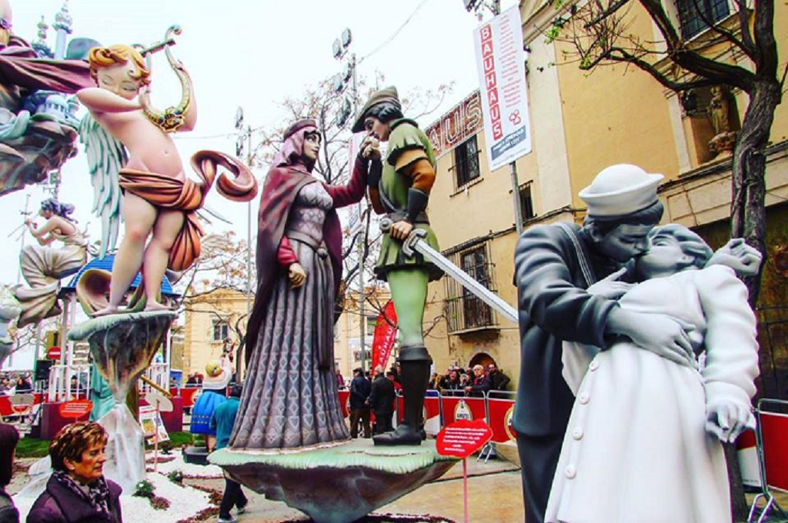
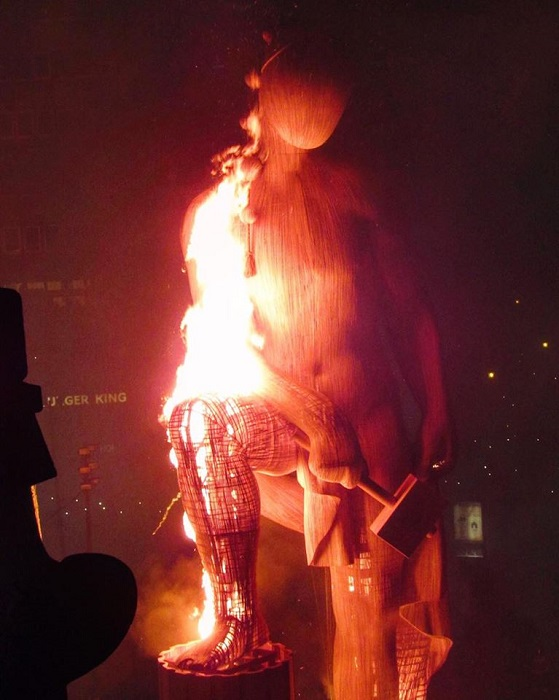

Spanish Festivals
=================

Las Fallas de Valencia
----------------------
Spain holds thousands of festivals and
celebrations each year, but one of the major
festivals that brings in people from around
the world each year is **Las Fallas**. The festival
is held in the city of Valencia from March 15-19,
but the excitement and preparation starts way
before then. [#f1]_

What is Las Fallas?
~~~~~~~~~~~~~~~~~~~
A festival that started as a celebration of
St. Joseph, patron saint of carpenters, turned
into a five day flaming extravaganza that
brings in millions of people.

For many people, the purpose of this festival
is for the parade and the eventual burning of
ninots, which are statues and figurines made
out of different materials like Styrofoam, wood,
papier- mâché and cardboard. [#f2]_

The Ninots
~~~~~~~~~~
The history of the creation of the ninot came
from the middle ages when carpentors would nail
planks of wood, called "parots", to hold their
candles up while they were working. In the spring,
the pieces of wood were burned to single the end
of the dark winter. After a while, the parots
were dressed up with clothing to identify a
local-personality. [#f3]_

   Ninots [#f4]_

The ninots, some with a cost of $100,000 dollars
to make and a year to make, are paraded around
the city and then set on fire under a big firework
display on March 19, La Crema as it is called.

One ninot is spared from burning by winning
the popular vote. This ninot, the ninot
indultat, is saved and stored in the local
Fallas Museum. `This`_ was the ninot indultat of 2019.

.. _this: https://www.levante-emv.com/fallas/2019/03/15/ganador-ninot-indultat-2019-fallas/1848852.html

**"The scene at Las Fallas is extremely
cathartic and difficult to describe,
but resembles a cross between a bawdy
Disneyland, the Fourth of July, and the
end of the world,"** [#f5]_ traveler and self-described
pyromaniac Janet Morton told *Don Quijote*.

   Giant burning ninot for La Crema [#f6]_

The burning of the fallas is not the only
event held at the festival, bullfights, paella
contests, beauty pagents and flower offerings draw
attention as well.

The festival is known to make a lot of noise and
commotion. It’s not for the feint of heart, and
pregnant women are not allowed to attend.

Festivals
---------

To convey how much festivals are rooted into the
culture and identity of Spanish life, below are a
list of other popular festivals that are attented
by the locals and tourists alike. [#f7]_

============= ===================================== ===========================================
When (2020)    Name                                 Description/ Activities
============= ===================================== ===========================================
Jan 19-20     Tamborrada                            Eating and drinking wine while
                                                    watching drummers parade around the city
Mar 15-19     Las Fallas                            Weeks long of excitement and preperation
                                                    to make big statues with other activities
Feb 20- Mar 1 Carnival                              Crazy event with costumes, street parties
                                                    and circus themed events
Apr 25- May 2 Seville Feria                         Parades, regional food and dancing
Jun 27-30     Haro Wine Festival                    Main feature is a wine fight
Jul 6-14      San Fermin & The Running of the Bulls One of the most famous festivals in Spain,
                                                    at the start of the day bulls are
                                                    released to chase large crowd through city.
============= ===================================== ===========================================

.. rubric:: Footnotes

.. [#f1] "`Las Fallas beginning information <https://www.driftwoodjournals.com/discover-valencias-las-fallas-festival-everything-you-need-to-know-about-spains-most-explosive-festival/>`_". Driftwood Journals. 2017. Retrieved 2019-11-22.
.. [#f2] "`What is Las Fallas and the history <https://www.travelandleisure.com/travel-news/aerosmith-las-vegas-tourism-slogan-what-happens-here>`_". Meredith Corporation. 2018. Retrieved 2019-11-22.
.. [#f3] "`Ninots history <https://www.spanish-fiestas.com/festivals/las-fallas/>`_". Spanish Fiestas. 2019. Retrieved 2019-11-23.
.. [#f4] "`Ninots <https://www.driftwoodjournals.com/discover-valencias-las-fallas-festival-everything-you-need-to-know-about-spains-most-explosive-festival/>`_." Driftwood Journals. 2017. Retrieved 2019-11-22.
.. [#f5] "`Janet Morton describing Las Fallas <https://www.travelandleisure.com/travel-news/las-fallas-festival-ninots-valencia-spain>`_." Driftwood Journals. 2017. Retrieved 2019-11-22.
.. [#f6] "`Giant burning ninot for La Crema <https://www.driftwoodjournals.com/discover-valencias-las-fallas-festival-everything-you-need-to-know-about-spains-most-explosive-festival/>`_." Driftwood Journals. 2017. Retrieved 2019-11-22.
.. [#f7] "`Table of popular Spanish festivals <https://www.citylifebarcelona.com/major-festivals-in-spain/>`_". CityLife Barcelona. 2019. Retrieved 2019-11-27.