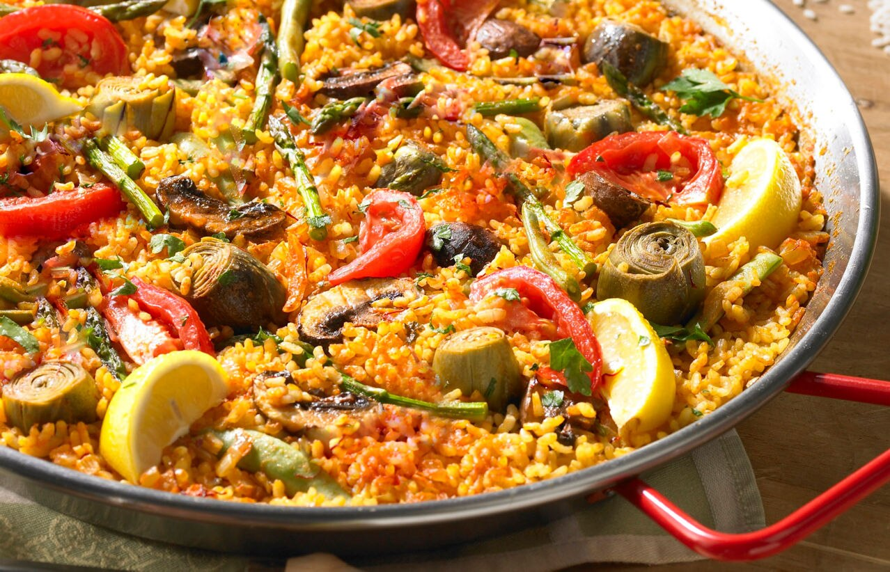
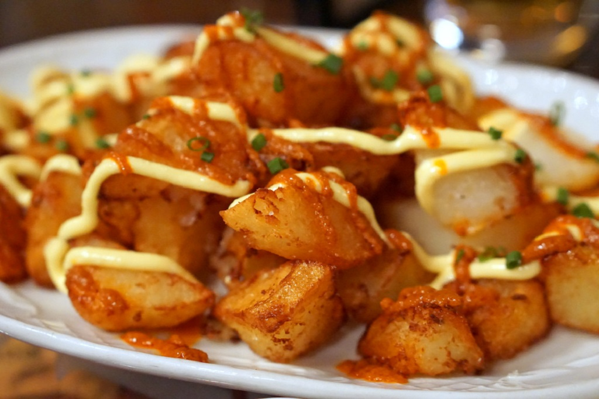
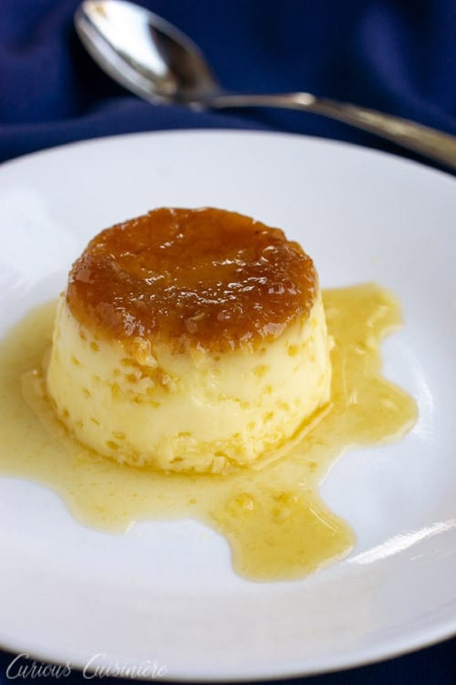

Spanish Food
============

Spain has developed quite the profile when it
comes to the quality and variety of food,
and to only limit the list down would be a
dishonor to the many dishes that can be found.
Like many other countries, the regions within
Spain are known to have their own different
flavor profiles and dish origins because of
weather and ethnicity variances. However, there
are some that are considered to be a commonality
of most Spanish cities, such as a plate of
croquettes (a fried snack) or tortilla Espanola
(a Spanish omelet). [#f1]_

Common Ingredients
------------------

The two most common ingredients found in Spanish
cuisine are olive oil and garlic. Other ingredient
staples include meats such as jamon serrano and
chorizo, seafood found in the coastal areas,
cheese, rice, beans, and eggs.

Paella
------
Some may call is the most famous dish of Spain,
Paella originated from Valencia and reigns as an
all-time favorite of the city with pride. There
are three main types of paella: meat (chicken,
rabbit, duck), seafood (shrimp,clams, fish),
vegetable (vegan) or mixed paella (meat, seafood,
vegetables). The name Paella is used to refer
to the pan that the dish is made in, with
ingredients like rice, beans and herbs that
are simmered. The large and wide diameter of
the pan allows for a good meal to have with
friends, typically during lunch. [#f2]_

   Vegetable Paella [#f3]_

Patatas Bravas
--------------
Patatas Bravos, or brave potatoes, are one
of the most common tapas found in Spain. Tapas
in Spain are like the appetizers or small snacks,
meant to bridge the gap between meals, since
dinner is typically eaten later in the day. [#f4]_

    Patatas Bravas [#f5]_

Flan
----
No highlight of Spanish food is complete
without mentioning one of their popular
desserts. While the list goes on and one
about the different sweets the Spaniards like
to make, Flan couldn’t not make an appearance
on discussing delicious staples, as it is
everywhere in Spain. In a classic flan
(vanilla), vanilla egg custard is used with
a caramel sauce on top. [#f6]_

   Flan [#f7]_

.. rubric:: Footnotes

.. [#f1] "`Spanish food <https://www.expatica.com/es/about/cuisine/top-10-spanish-foods-with-recipes-106723/>`_". Expatica. 2019. Retrieved 2019-11-22.
.. [#f2] "`Pealla information <https://www.worldtravelconnector.com/spanish-cusine-popular-spanish-food-to-eat-in-spain/>`_". Amazon Services LLB Associates Program. 2019. Retrieved 2019-11-22.
.. [#f3] "`Vegetable Paella <https://www.tienda.com/recipes/vegetarian-paella.html>`_". La Tienda. 2019. Retrieved 2019-11-22.
.. [#f4] "`Patatas bravas information <https://www.bookmundi.com/t/13-famous-spanish-dishes-to-eat-in-spain>`_". Bookmundi.com. 2018. Retrieved 2019-11-22.
.. [#f5] "`Patatas Bravas <https://spanishsabores.com/2018/08/26/patatas-bravas-recipe-spanish-fried-potatoes-with-spicy-sauce/>`_". Spanish Sabores. 2018. Retrieved 2019-11-22.
.. [#f5] "`Flan information <https://www.thespruceeats.com/top-spanish-desserts-3083056>`_". Dotdash. 2019. Retrieved 2019-11-22.
.. [#f7] "`Flan <https://www.curiouscuisiniere.com/spanish-flan/>`_". Curious Cuisiniere. 2018. Retrieved 2019-11-23.