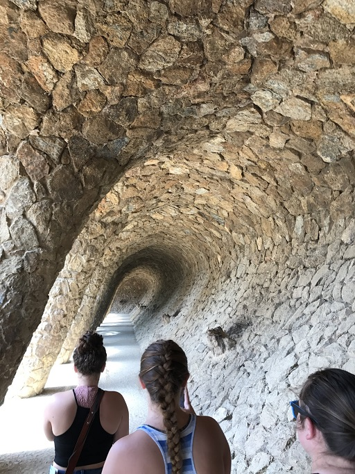
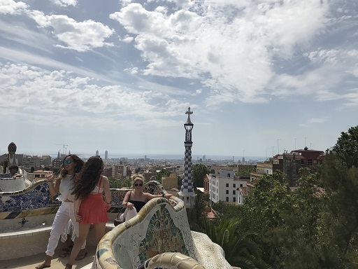
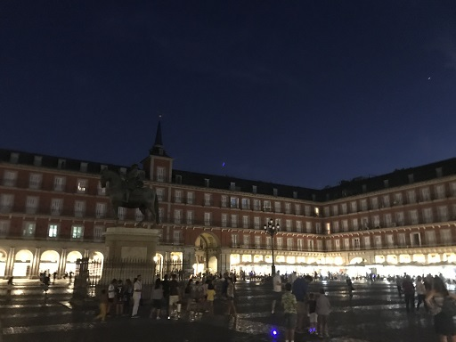
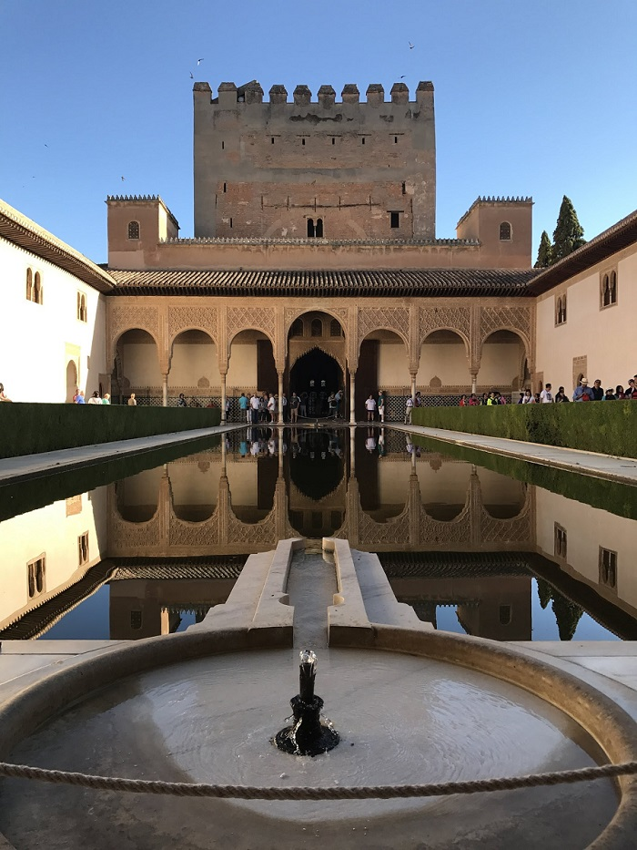

Popular Spanish Destinations
============================

Spain is home to a vast variety
of metropolitan areas, landscapes
and cultures that make the country a
popular travel and tourist destination
for many Europeans. To witness these
cultures, one must only stand in the
cities and in the forgotten alleys
to be astounded by the craftsmanship
of the architecture and the history that
still stands today.

The country offers destinations for
the photographer, the tourist, the
historian, and anyone else willing to
walk through the towns. To highlight
the diversity, the places mentioned will
be a mix ranging from historical charm to
tourist hotspots in populous cities.

Barcelona
---------

Park Guell
~~~~~~~~~~
With colors and curvy architecture,
this park truly captures the charm and
uniqueness of Barcelona. Originally
made for upper-class families but not
able to be completed, commissioner
Eusebi Güell continued to create with
a different vision based on gardens
he had seen in England that incorporated
the natural elements of nature. [#f1]_

La Sangrada Familia
~~~~~~~~~~~~~~~~~~~
Through multiple heads of construction
and changes are still being made to this day,
this work of architectural art is full of
symbolism and outstanding details that require
a attentive and patient eye to notice how much
work and consideration was put into the style.
It is projected that the church will be completed
in 2026, although it is hard to tell. [#f2]_

.. image:: s_sangrada-familia.jpg

Madrid
------

Plaza Mayor
~~~~~~~~~~~
This is a must-experience destination
that can be appreciated at day and night.
Because of how late Spaniards stay out and
eat, the square is always bustling with multiple
performers and cafes open to stop and grab an
order of churros and chocolate. Plaza Mayor also
serves tourists with the location of the
oldest restaurant in the world, Sobrino de Botín. [#f3]_

Estadio Santiago Bernabeu
~~~~~~~~~~~~~~~~~~~~~~~~~
For futbol fans, the city’s main futbol
stadium is home to Real Madrid. The size
capacity of the stadium reflects the city’s
and country’s love for futbol with a capacity
of 81,044 people. People can take a tour that
goes through the important parts of the stadium
like the locker room, award room and across the
field depending on the time of year. [#f4]_

Granada
-------

The Alcaiceria
~~~~~~~~~~~~~~
This market may look like a typical
tourist trap with its keychains and bright
colored costumes and dresses, there is a lot
more to offer in both material items and
historical context. What makes it more unique
is the history as a former place for silk making
and exchanging by the Moors. Walking through
the many passageways could get you lost or lead
you to an entirely new section of the market. [#f5]_

The Alhambra
~~~~~~~~~~~~
As one of the most visited spots in Spain,
the Alhambra serves the tourist, the history
and architecture folk with a royal background
and the ability to walk through it for hours. [#f6]_

.. rubric:: Footnotes

.. [#f1] "`Park Guell <https://travel.usnews.com/Barcelona_Spain/Things_To_Do/Guell_Park_Parc_Guell_26913/>`_". U.S. News & World Report. 2019. Retrieved 2019-11-22.
.. [#f2] "`La Sangrada Familia <https://travel.usnews.com/Barcelona_Spain/Things_To_Do/Church_of_the_Sacred_Family_Templo_Expiatorio_de_la_Sagrada_Familia_26915/>`_". U.S. News & World Report. 2019. Retrieved 2019-11-22
.. [#f3] "`Playa Mayor <https://travel.usnews.com/Madrid_Spain/Things_To_Do/Plaza_Mayor_25370/>`_". U.S. News & World Report. 2019. Retrieved 2019-11-22.
.. [#f4] "`Estadio Santiago Bernabeu <https://travel.usnews.com/Madrid_Spain/Things_To_Do/Bernabeu_Stadium_Estadio_Santiago_Bernabeu_25383/>`_".U.S. News & World Report. 2019. Retrieved 2019-11-22.
.. [#f5] "`The Alcaiceria <https://travel.usnews.com/Granada_Spain/Things_To_Do/The_Alcaiceria_63419/>`_".  U.S. News & World Report. 2019. Retrieved 2019-11-22.
.. [#f6] "`The Alhambra <https://travel.usnews.com/Granada_Spain/Things_To_Do/The_Alhambra_63420/>`_". U.S. News & World Report. 2019. Retrieved 2019-11-22.