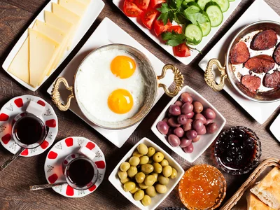
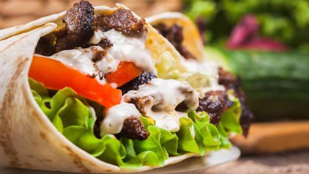

Turkish Food
============
Not only does Turkey have an enriching culture but it
also has a variety of delicious dishes. Its cuisine is
influenced by Greek, Middle Eastern, Central Asian, and
Eastern European cuisine.

**Turkish Breakfast:**

Breakfast is the most important meal of the day and what better to start your day then consuming an assortment of savory and sweet options.
A typical Turkish breakfast is comprised of:

* Tea
* Different types of bread
* Feta cheese
* Black/green olives
* Honey
* Jam
* Butter
* Boiled eggs
* Omelet
* Sliced tomatoes
* Sliced cucumbers

   Traditional breakfast [#bm1]_

A breakfast favorite would have to be *Sucuk*.
Sucuk is dried sausage made of ground beef with
garlic, sumac, red pepper, and cumin.

**Turkish Lunch:**

Next comes lunch, a popular Turkish meal eaten
during this time is a doner kebab. A doner
kebab is a pita that is filled with either
chicken or lamb then topped with tomato, lettuce,
and dressed with a yogurt sauce similar to tzatziki.

   Turkish doner kebab [#bm2]_

**Turkish Dinner:**

Around dinner time a dish called dolma
or sarma. Both can either be a side dish
or a main meal. sarma is made with grape
vine leaves stuffed with rice and spices,
then simmered in olive oil. It is served cold.

.. [#bm1] "`Everything You Need to Know About a Full Turkish Breakfast <https://www.foodandwine.com/breakfast-brunch/make-turkish-breakfast-kahvalti>`_". Food and Wine. August 10, 2017. Retrieved 2019-12-11.

.. [#bm2] "`Turkish Doner Kebab <https://www.thefork.com/restaurant/turkish-doner-kebab/543489>`_". The Fork. Unknown. Retrieved 2019-12-11.
