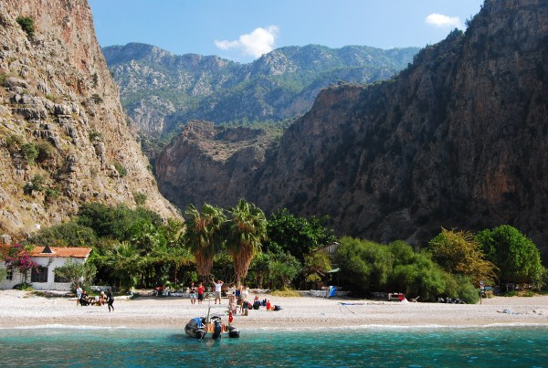
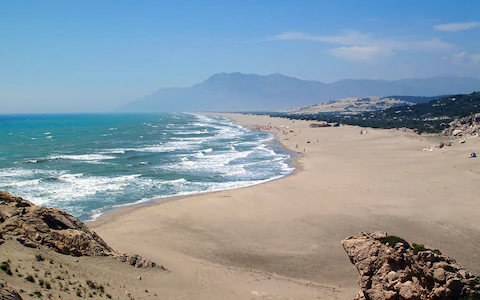
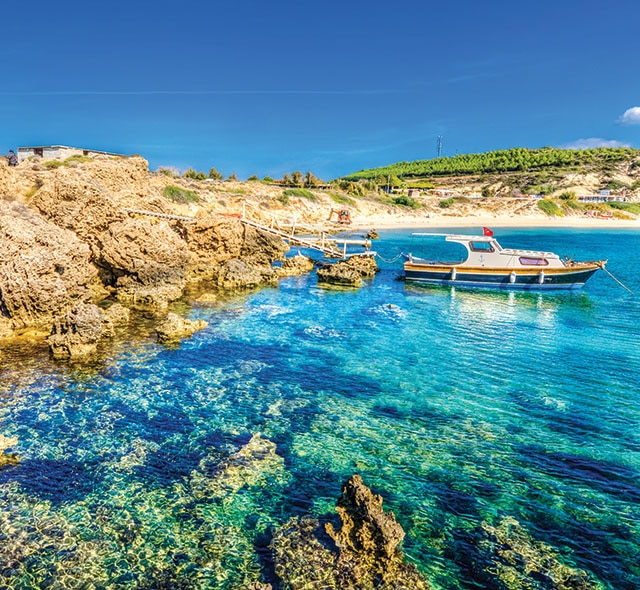
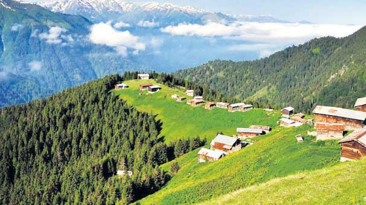
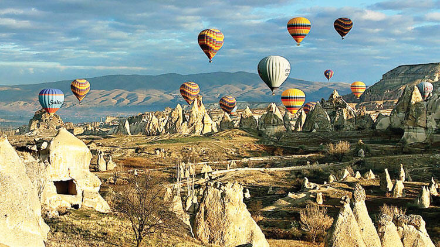

Turkey Travel
=============

Turkey is filled with destinations
that attracts not only its habitants
but a vast number of tourists as well.
With the changing seasons the travel
spots change as well.

**Summer:**

Butterfly Valley:

Located in Oludeniz, Butterfly Valley
is home beautiful hills, crystal clear
waters and gorgeous views. Summer is a
great time to visit to enjoy the refreshing
lake, go for boat rides and hike numerous trails.

   Traditional breakfast [#bm4]_

Patara:

A well- known tourist spot and gorgeous
beach Patara is popular amongst the young
and old. It offers not only a pristine beach
but an amazing view of endless mountains.
It is said that if you stand on a sand dune
at the right time, you will be able to see the
sunset and the moon rise at the same time.

   Patara [#bm5]_

**Fall:**

Bozcaada:

Fall is a great time to visit Bozcaada
because of the grape harvesting on the
island. Not to mention the island becomes
calm and serene during this time of year.

   Bozcaada [#bm6]_

Artvin:

This Black Sea region has stunning natural
landscapes such as the Kackar mountains.
The Kackar mountains are part of the mountain
villages located on Artvin and offer numerous
hiking trails.

   Artvin [#bm7]_

**Winter:**

Cappadocia:

Beautiful during the winter this spot
offers natural structures that take on
different shapes. Great hiking trails
and some of the caves located in the
region are now hotels.

   Cappadocia [#bm8]_

Side:

A wonderful destination filled with entertainment.
From shops, gardens, pizza places, and dance halls
this is a tourist dream come true.

.. [#bm4] "`Butterfly Valley <https://turkishtravelblog.com/butterfly-valley/>`_". Turkish Travel Blog. Unknown. Retrieved 2019-12-11.

.. [#bm5] "`Patara, Turkey: Secret Seaside <https://www.telegraph.co.uk/travel/destinations/europe/turkey/turquoise-coast/articles/Patara-Turkey-Secret-Seaside/>`_". The Telegraph. July 2015. Retrieved 2019-12-11.

.. [#bm6] "`Experience Bozcaada <https://www.rssc.com/destinations/mediterranean/ports-excursions/BOZ/regent-choice-plus-free>`_". Regent Seven Seas Cruises. Unknown. Retrieved 2019-12-11.

.. [#bm7] "`Artvin <https://newcastlebeach.org/image/artvin/909.html>`_". Newcastlebeach. Unknown. Retrieved 2019-12-11.

.. [#bm8] "`Balloon ride consortium under scrutiny in Cappadocia <http://www.hurriyetdailynews.com/balloon-ride-consortium-under-scrutiny-in-cappadocia-144035>`_". Hurriyet Daily News. June 2019. Retrieved 2019-12-11.